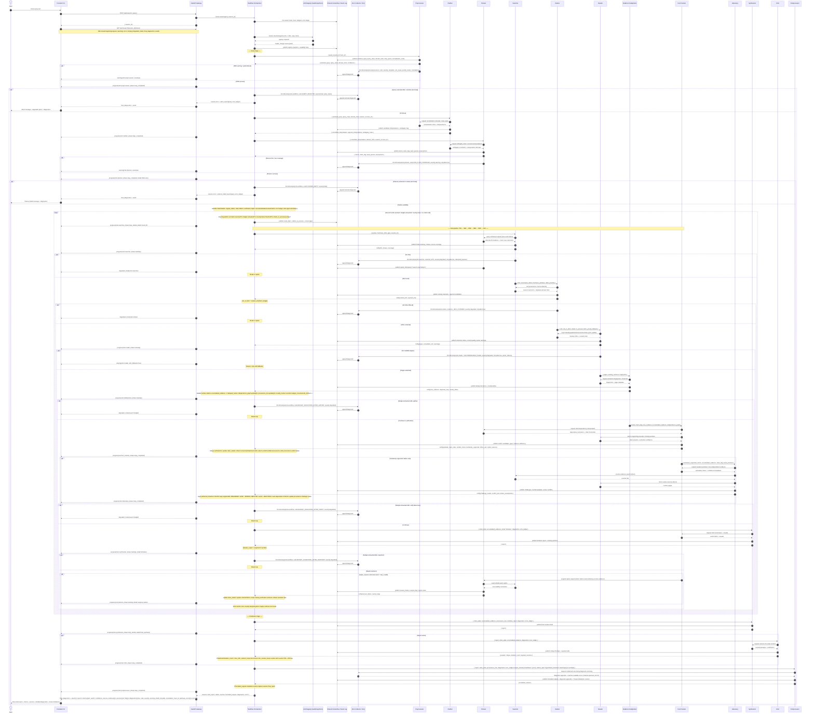

```mermaid
sequenceDiagram
    autonumber
    actor User
    participant UI as Frontend / UI
    participant API as FastAPI Gateway
    participant WF as Workflow Orchestrator
    participant REG as A2A Registry (health/caps/SLO)
    participant BUS as Shared Context Bus / Event Log
    participant ERR as Error Collector / DLQ
    participant PRE as Preprocessor
    participant CLR as Clarifier
    participant PLN as Planner
    participant SEA as Searcher
    participant RNK as Ranker
    participant REA as Reader
    participant DED as Evidence Deduplicator
    participant FAC as Fact Checker
    participant ADV as Adversary
    participant SYN as Synthesizer
    participant CRI as Critic
    participant POS as Postprocessor

    User->>UI: Enter query text
    UI->>API: POST /api/research { query }
    API->>WF: create session(query, session_id)
    WF->>BUS: init session state, trace, budgets, error ledger
    API-->>UI: { session_id }
    UI->>API: GET /api/research/{session_id}/stream
    Note over UI,API: SSE stream begins\n(progress | warning | error | retrying | degraded_mode | final_diagnostics | result)

    WF->>REG: resolve mounted agents (role -> URL, caps, SLO)
    REG-->>WF: registry snapshot
    REG--)WF: health_change events (push)
    WF->>BUS: publish registry snapshot + capability map

    Note over WF: ── Setup stage ──
    WF->>PRE: { query, session_id, trace_id }
    PRE->>BUS: publish sanitized_query, query_class, domain_hints, risky_spans, normalization_notes
    PRE-->>WF: { sanitized_query, query_class, domain_hints, confidence }
    alt PRE warning / partial failure
        PRE->>ERR: ErrorEnvelope{role:preprocessor, code, severity, retryable, root_cause, partial_results, remediation}
        ERR->>BUS: append diagnostic
        API-->>UI: warning(role=preprocessor, envelope)
    else PRE success
        API-->>UI: progress(role=preprocessor, phase=step_completed)
    end

    alt Query unanswerable / sensitive (terminal)
        WF->>ERR: ErrorEnvelope{role:workflow, code:QUERY_REJECTED, severity:fatal, policy_basis}
        ERR->>BUS: append terminal diagnostic
        WF-->>API: session.error + abort_report(query, error_ledger)
        API-->>UI: final_diagnostics + result
        UI-->>User: Abort message + degraded report + diagnostics
    else Continue
        WF->>CLR: { sanitized_query, query_class, domain_hints, session_id, trace_id }
        CLR->>PRE: request normalization rationale / risky spans
        PRE-->>CLR: normalization notes + stripped terms
        CLR->>BUS: publish candidate interpretations + ambiguity map
        CLR-->>WF: { committed_interpretation, rejected_interpretations, ambiguity_notes }
        API-->>UI: progress(role=clarifier, phase=step_completed)

        WF->>PLN: { committed_interpretation, domain_hints, session_id, trace_id }
        PLN->>CLR: request ambiguity notes / unresolved assumptions
        CLR-->>PLN: ambiguity constraints + interpretation rationale
        PLN->>BUS: publish claims, claim_dag, seed_queries, assumptions
        PLN-->>WF: { claims, claim_dag, seed_queries, assumptions }
        alt Planner thin / low coverage
            PLN->>ERR: ErrorEnvelope{role:planner, code:LOW_CLAIM_COVERAGE, severity:warning, retryable:true}
            ERR->>BUS: append diagnostic
            API-->>UI: warning(role=planner, envelope)
        else Planner success
            API-->>UI: progress(role=planner, phase=step_completed, detail=DAG size)
        end

        alt Planner produced no claims (terminal)
            WF->>ERR: ErrorEnvelope{role:workflow, code:PLANNER_EMPTY, severity:fatal}
            ERR->>BUS: append terminal diagnostic
            WF-->>API: session.error + planner_failed_report(query, error_ledger)
            API-->>UI: final_diagnostics + result
            UI-->>User: Planner failed message + diagnostics
        else Claims available
            Note over WF: Initialize ClaimState\n• original_claims, claim DAG\n• verification map\n• unresolved/stale/resolved lists\n• error ledger, inter-agent annotations

            loop Round N until resolved / budget exhausted / novelty drops / no claims left
                Note over WF: Round guards\n• all claims resolved?\n• budget exhausted?\n• novelty below threshold?\n• claims_to_process() empty?
                WF->>BUS: publish round_start + claims_to_process + current gaps
                API-->>UI: progress(role=searcher, phase=step_started, detail=round_N)

                Note over WF,FAC: ── A2A pipeline: PLN → SEA → RNK → REA → DED → FAC ──
                WF->>SEA: { queries, freshness_hints, gaps, session_id }
                SEA->>PLN: query refinement request (low-recall claims)
                PLN-->>SEA: alternate formulations + must-cover subclaims
                SEA->>BUS: publish hitset summary, misses, source coverage
                SEA--)WF: notify(hits, misses, coverage)
                API-->>UI: progress(role=searcher, phase=substep)

                alt No hits
                    SEA->>ERR: ErrorEnvelope{role:searcher, code:NO_HITS, severity:degraded, retryable:true, attempted_queries}
                    ERR->>BUS: append diagnostic
                    PLN->>BUS: publish replan_hint(reason="search recall failure")
                    API-->>UI: degraded_mode(role=searcher)
                    Note over WF: Break or replan
                else Hits found
                    SEA->>RNK: { hits, unresolved_claims, freshness_windows, claim_priorities }
                    RNK->>SEA: ask provenance / source diversity
                    SEA-->>RNK: source trust priors + duplicate-domain hints
                    RNK->>BUS: publish ranking rationale + rejected candidates
                    RNK--)WF: notify(ranked_urls, rejected_urls)
                    Note over WF: urls_to_fetch = ranked_urls[:fetch_budget]

                    alt All URLs filtered
                        RNK->>ERR: ErrorEnvelope{role:ranker, code:ALL_URLS_FILTERED, severity:degraded, retryable:true}
                        ERR->>BUS: append diagnostic
                        API-->>UI: degraded_mode(role=ranker)
                        Note over WF: Break or replan
                    else URLs selected
                        RNK->>REA: { urls: urls_to_fetch, claims: to_process, fetch_priority, fallbacks }
                        REA->>RNK: report dead/paywalled/robots-blocked URLs (prior update)
                        RNK-->>REA: backup URLs + revised order
                        REA->>BUS: publish extraction status, content quality, parser warnings
                        REA--)WF: notify(pages, unreadable_urls, warnings)
                        API-->>UI: progress(role=reader, phase=substep)

                        alt No readable pages
                            REA->>ERR: ErrorEnvelope{role:reader, code:UNREADABLE_PAGES, severity:degraded, retryable:true, parser_failures}
                            ERR->>BUS: append diagnostic
                            API-->>UI: retrying(role=reader, with_fallbacks=true)
                            Note over WF: Break or retry with fallbacks
                        else Pages extracted
                            REA->>DED: { pages, existing_evidence, fingerprints }
                            DED->>REA: request extraction fingerprints / chunk IDs
                            REA-->>DED: fingerprints + page metadata
                            DED->>BUS: publish dedupe decisions + novelty deltas
                            DED--)WF: notify(new_evidence, duplicate_map, novelty_delta)
                            Note over WF: Update runtime state\n• accumulated_evidence += deduped_new\n• independence_graph.update()\n• provenance_tree.update()\n• novelty_tracker counts\n• budget_consumed.urls_fetched +=
                            API-->>UI: progress(role=deduplicator, phase=substep)

                            alt Budget exhausted after gather
                                WF->>ERR: ErrorEnvelope{role:workflow, code:BUDGET_EXHAUSTED_AFTER_GATHER, severity:degraded}
                                ERR->>BUS: append diagnostic
                                API-->>UI: degraded_mode(reason=budget)
                                Note over WF: Break loop
                            else Continue to verification
                                DED->>FAC: { claims, claim_dag, new_evidence, accumulated_evidence, independence_graph }
                                FAC->>PLN: request claim dependency interpretation
                                PLN-->>FAC: dependency semantics + claim thresholds
                                FAC->>REA: ask for supporting excerpts / missing sections
                                REA-->>FAC: cited excerpts + extraction confidence
                                FAC->>BUS: publish verdict candidates, gaps, evidence sufficiency
                                FAC--)WF: notify(updated_claim_state, verified_claims, tentatively_supported, follow_ups, replan_reasons)
                                Note over WF: Merge verification\n• update claim_state\n• refresh unresolved/stale/resolved\n• attach verdict/confidence/sources\n• write provenance verdict nodes
                                API-->>UI: progress(role=fact_checker, phase=step_completed)

                                alt Tentatively supported claims exist
                                    FAC->>ADV: { tentatively_supported_claims, accumulated_evidence, claim_dag, weak_premises }
                                    ADV->>FAC: request weakest premises / low-independence evidence
                                    FAC-->>ADV: vulnerable claims + confidence breakdown
                                    ADV->>SEA: counter-evidence search (direct)
                                    SEA-->>ADV: counter-hits
                                    ADV->>REA: fetch counter-sources (direct)
                                    REA-->>ADV: counter-pages
                                    ADV->>BUS: publish challenges, counterexamples, source conflicts
                                    ADV--)WF: notify(challenge_results, conflict_sets, broken_assumptions)
                                    Note over WF: Apply adversary results\n• HOLDS: keep supported\n• WEAKENED: verdict→MIXED\n• REFUTED: verdict→REFUTED\n• mark dependents STALE\n• update provenance challenge nodes
                                    API-->>UI: progress(role=adversary, phase=step_completed)
                                end

                                alt Budget exhausted after verify/adversary
                                    WF->>ERR: ErrorEnvelope{role:workflow, code:BUDGET_EXHAUSTED_AFTER_VERIFY, severity:degraded}
                                    ERR->>BUS: append diagnostic
                                    API-->>UI: degraded_mode(reason=budget)
                                    Note over WF: Break loop
                                else Continue
                                    WF->>SYN: { claim_state, accumulated_evidence, mode:"tentative", diagnostics: error_ledger }
                                    SYN->>FAC: request claim summaries + caveats
                                    FAC-->>SYN: verdict table + caveats
                                    SYN->>BUS: publish tentative report + missing sections
                                    SYN-->>WF: { report }
                                    Note over WF: tentative_report = snapshot if coercible
                                    API-->>UI: progress(role=synthesizer, phase=substep, detail=tentative)

                                    alt Budget exhausted after snapshot
                                        WF->>ERR: ErrorEnvelope{role:workflow, code:BUDGET_EXHAUSTED_AFTER_SNAPSHOT, severity:degraded}
                                        ERR->>BUS: append diagnostic
                                        Note over WF: Break loop
                                    else Replan decision
                                        alt replan_reasons exist and round < max_rounds
                                            FAC->>PLN: surgical replan request (which claims need reframing vs more evidence)
                                            PLN->>SEA: seed refined search paths
                                            SEA-->>PLN: sourceability constraints
                                            PLN->>BUS: publish revised_claims / revised_dag / replan notes
                                            PLN--)WF: notify(revised_claims, revised_dag)
                                            Note over WF: Update claim_state\n• replace claims/DAG\n• create missing verification entries\n• refresh resolution lists
                                            API-->>UI: progress(role=planner, phase=substep, detail=surgical_replan)
                                        end
                                        Note over WF: End round\n• store novelty marginal gain\n• maybe continue next round
                                    end
                                end
                            end
                        end
                    end
                end
            end

            Note over WF: ── Finalization stage ──
            WF->>SYN: { claim_state, accumulated_evidence, provenance_tree, tentative_report, diagnostics: error_ledger }
            SYN->>BUS: publish final narrative draft
            SYN-->>WF: { report }
            API-->>UI: progress(role=synthesizer, phase=step_started, detail=final_synthesis)

            opt Report exists
                WF->>CRI: { report, claim_state, accumulated_evidence, diagnostics: error_ledger }
                CRI->>SYN: request revisions for weak sections
                SYN-->>CRI: revised passages + justification
                CRI->>BUS: publish critique findings + required edits
                CRI-->>WF: { passed, critique, iteration_count, required_revisions }
                Note over WF: If failed and iteration_count < max_critic_revision_loops,\nincrement critic_revision_loops counter and re-enter SYN↔CRI loop
                API-->>UI: progress(role=critic, phase=step_completed)
            end

            WF->>POS: { report, claim_state, provenance_tree, diagnostics: error_ledger,\noutput_formats:["markdown","json"], citation_style:"hyperlinked_footnotes",\nwarnings:[] or [critique] }
            POS->>ERR: request condensed user-facing diagnostic summary
            ERR-->>POS: diagnostic appendix + machine-readable errors (chained upstream_errors)
            POS->>BUS: publish formatted outputs + diagnostic appendix + "Known limitations" section
            POS-->>WF: { formatted_outputs }
            Note over WF: If formatted_outputs.markdown exists,\nreplace session.final_report
            API-->>UI: progress(role=postprocessor, phase=step_completed)

            WF-->>API: session { final_report, claims, sources, formatted_outputs, diagnostics, error? }
            API-->>UI: final_diagnostics + result {\n  report,\n  claims:[{text, verdict, confidence, sources, evidence}],\n  sources:[{url, title}],\n  diagnostics:[{role, code, severity, summary, detail, retryable, remediation, trace_id, upstream_errors}],\n  error?\n}
            UI-->>User: Final cited report + claims + sources + detailed diagnostics + known limitations
        end
    end
```
